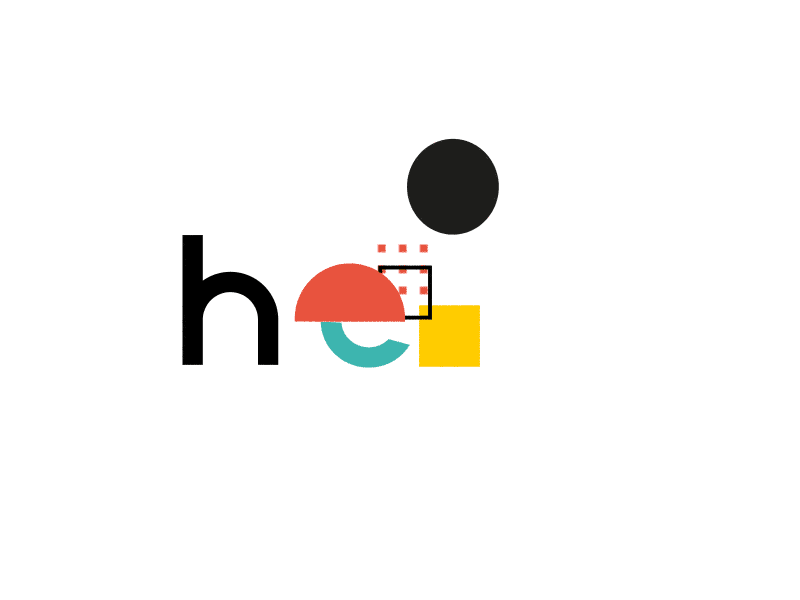

## 👋 Hi, I’m Ambuj Bhaskar

### My Tools & Technologies 

<!--  -->

* 👀 I’m interested in Software Development, Web Development, Game Development, Web design.
* 🌱 I’m currently learning Electron.js.
* 💞️ I’m looking to collaborate and learn on Web development projects or Game Development projects.
* 📫 How to reach me: bhaskarambuj7@gmail.com or ambuj20358@iiitd.ac.in

